# Student Management System

Web-based Student Management System built with core PHP, MySQL, and JavaScript. Meant for schools/coaching centers/educational institutes to manage students, batches, exams, results, payments, attendance, and SMS notices from one dashboard.

This is a fork of [[(https://github.com/JackByteBack/Student-Management-System.git)]((https://github.com/JackByteBack/Student-Management-System.git)), patched to run on PHP 8.2+.

## What's Different in This Fork

| Change | Why |
|---|---|
| Added `#[\AllowDynamicProperties]` to `database`, `dbclass` | PHP 8.2 deprecated implicit dynamic properties; these classes rely on them |
| Attribution updated in footer/login/install screens | Credits this fork |

Core app logic, schema, and features are unchanged from upstream.

## Tech Stack

| Layer | Tech |
|---|---|
| Backend | PHP (procedural, no framework) |
| Database | MySQL |
| Frontend | HTML, CSS, Bootstrap, JavaScript, Ajax |
| Charts | Chart API (bundled in `/tool/chart_api`) |
| PDF/ID Card | Bundled PDF + barcode libs (`/tool/pdf`, `barcode.php`) |

## Features

| Module | What it does |
|---|---|
| Student | Add student, admit into multiple programs, view/edit profile |
| Payment | Track student payments, generate money receipts |
| Attendance | Mark & report student attendance (monthly reports) |
| ID Card | Generate and print student ID cards |
| Program | Create programs/batches students can be admitted into |
| Exam & Result | Add exams, enter results, auto-generate ranking |
| SMS | Send results and notices via SMS |
| Reports | Payment, expense, income, profit, attendance reports |
| Activity Log | Auto-logs changes; admin can compare previous vs current data |
| Themes | Multiple UI themes, switchable from settings |

## Folder Structure

| Path | Contents |
|---|---|
| `config/` | DB connection (`connect.php`, `dbclass.php`, `db.php`) and site config |
| `page/` | Page templates/views for each module |
| `page_action/` | Backend logic invoked by each page (CRUD, processing) |
| `script/` | JS for each module (Ajax calls, form handling) |
| `layout/` | Shared header, footer, sidebar, nav |
| `sql/install_sql.sql` | Full DB schema, imported automatically on install |
| `tool/` | Third-party bundled tools (PDF, date picker, chart API, color picker) |
| `student/` | Standalone student-facing portal |
| `screen_shot/` | UI screenshots used in this README |

## Requirements

- PHP 8.2+
- MySQL / MariaDB
- Apache/Nginx with PHP support (XAMPP/WAMP/LAMP all work locally)

## Installation

1. Clone the repo:
   ```bash
   git clone https://github.com/JackByteBack/Student-Management-System.git
   ```
2. Place it in your server's document root (e.g. `htdocs/` for XAMPP).
3. Update `config/db.php` with your DB credentials, or leave the defaults (`root` / `password` / `student_management_system`) if that matches your local setup:
   ```php
   define('db_host', 'localhost');
   define('db_user', 'root');
   define('db_pass', 'password');
   define('db_name', 'student_management_system');
   ```
4. Create a MySQL database with that name, then open the project in your browser — you'll land on the install wizard.
5. Fill in your DB host, username, password, and database name. Submitting this auto-imports `sql/install_sql.sql`.
6. On success, log in with the default credentials:
   - **Username:** `admin`
   - **Password:** `admin`
7. Change the default password immediately after first login.

## Screenshots

| | |
|---|---|
| 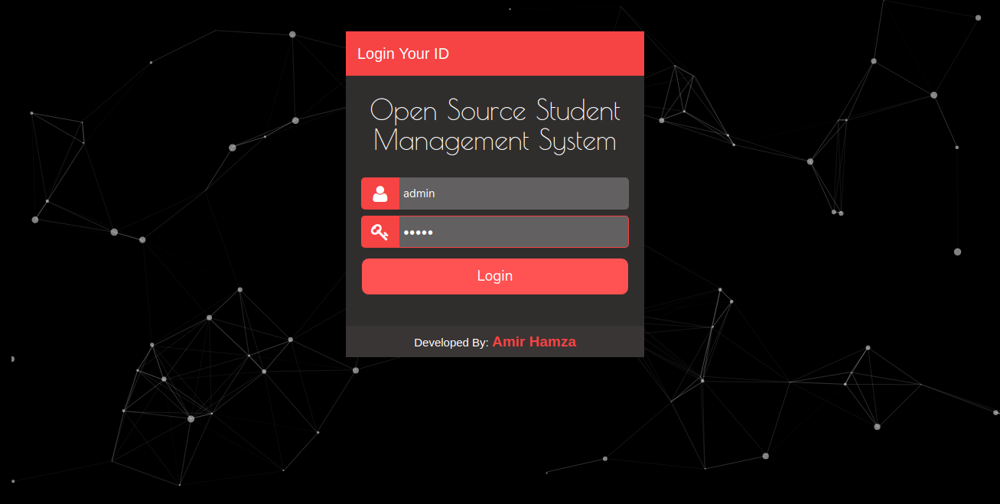 Login | 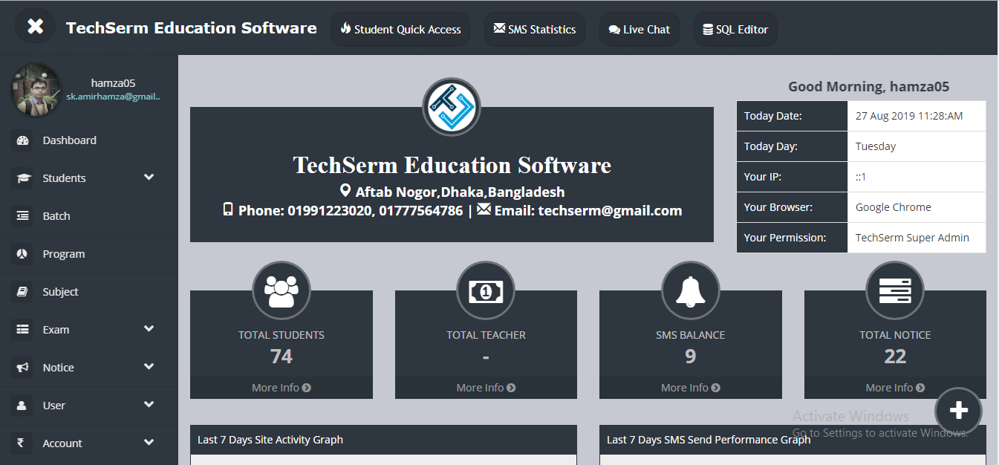 Dashboard |
| 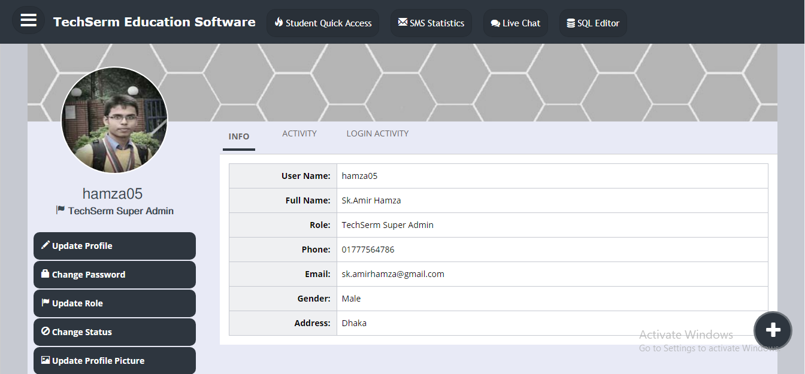 User Profile | 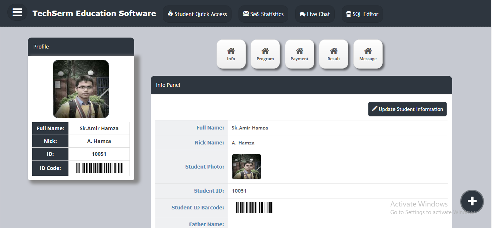 Student Profile |
| 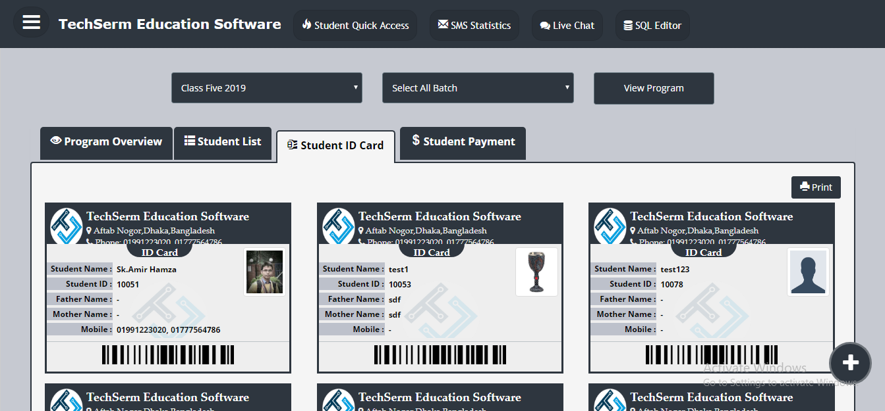 ID Card | 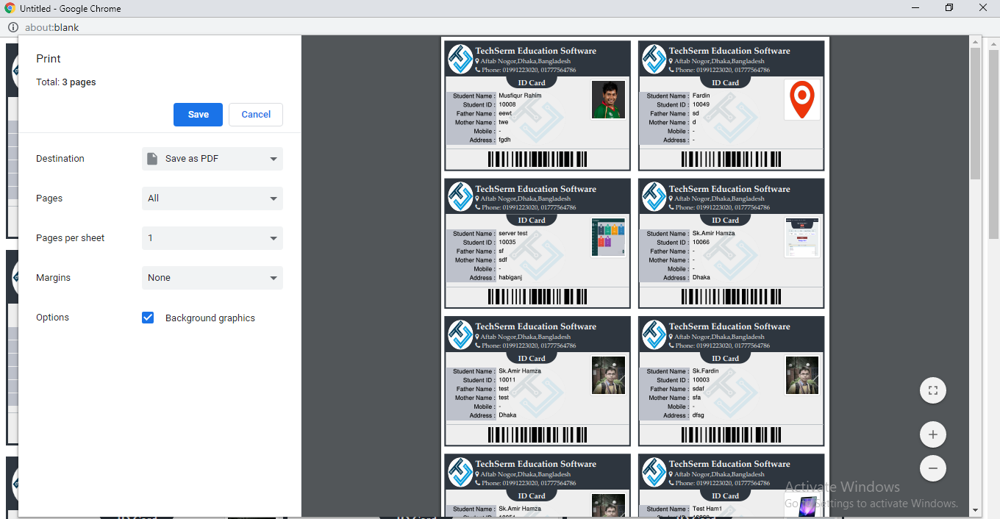 Print ID Card |
| 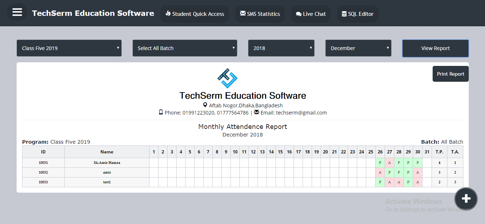 Attendance Report | 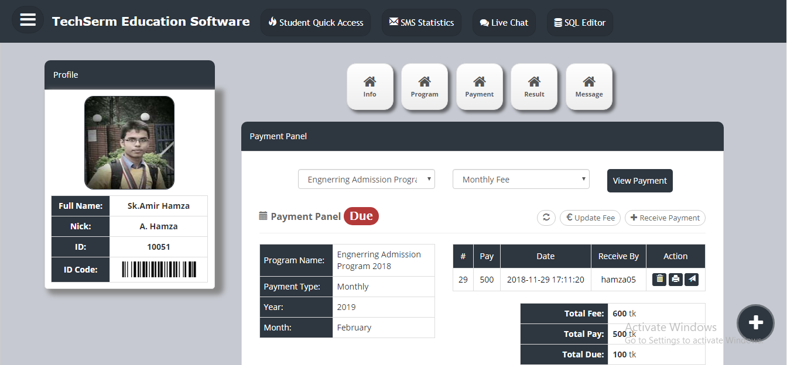 Payment Dashboard |
| 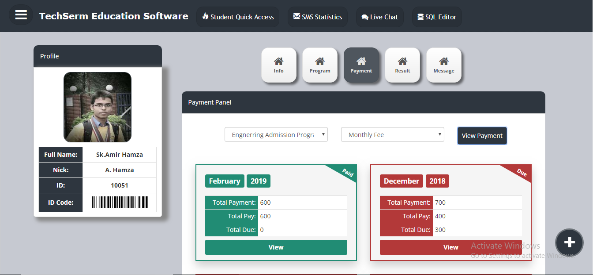 Payment Status List | 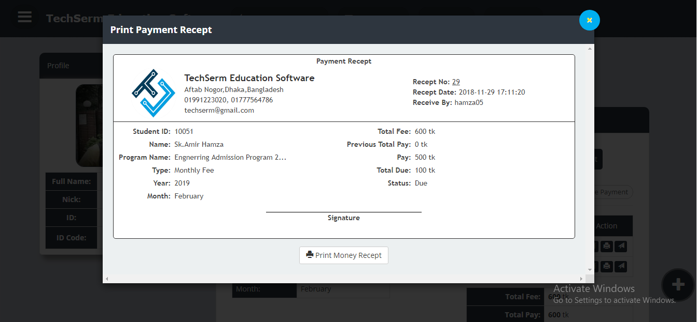 Money Receipt |
| 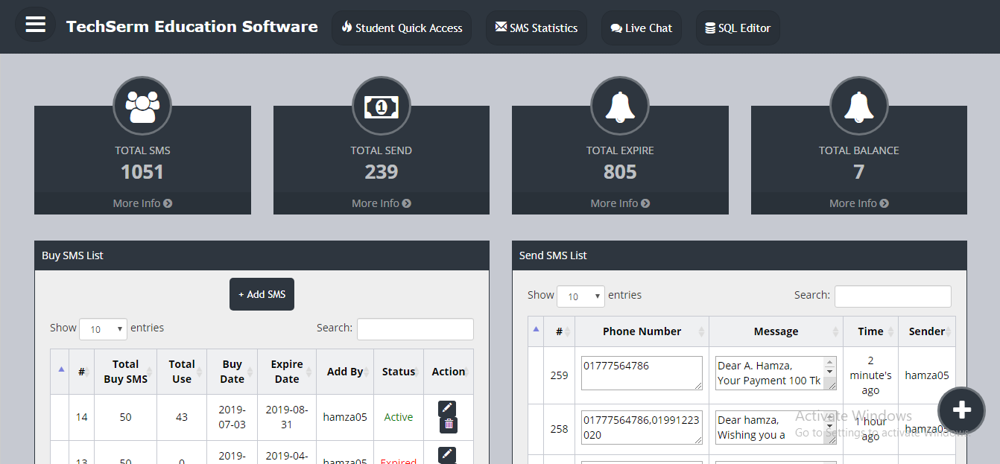 SMS Dashboard | 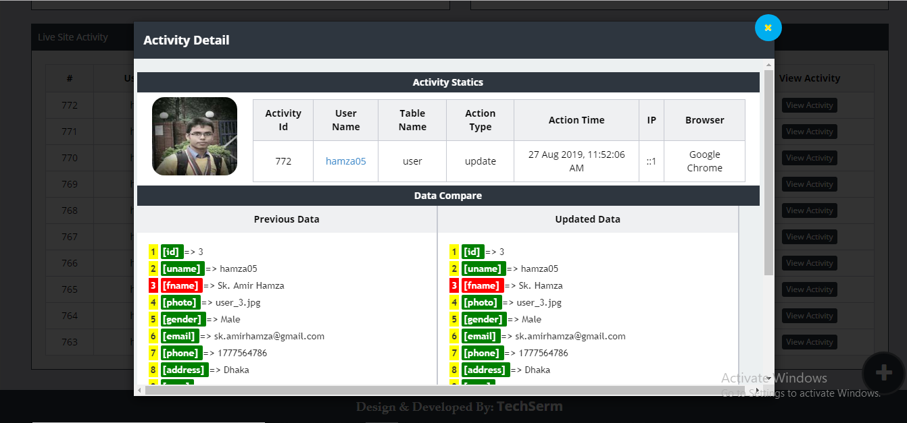 Compare User Activity |
| 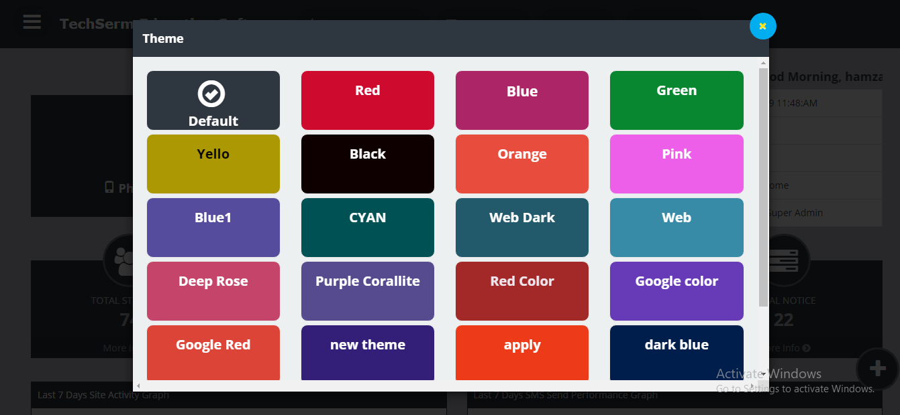 Multiple Themes | 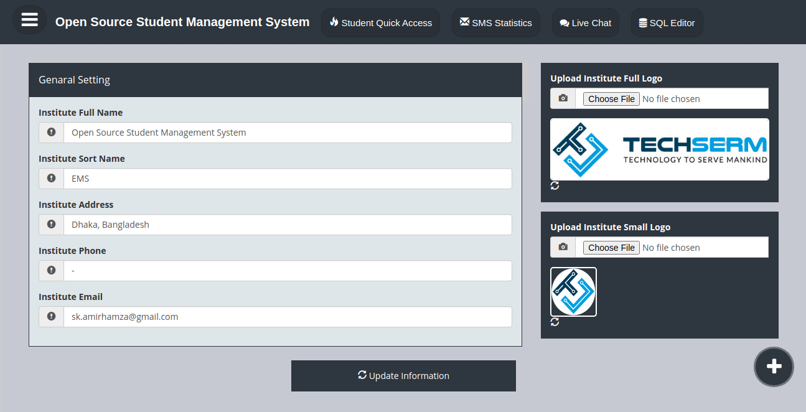 Institute Settings |

## Credits

Original project by [JackByteBack](https://github.com/JackByteBack).
